## Part 2: Badge Programming

Programming the Microcontroller
1)	Download the badge repo and unzip somewhere on your local drive:
a.	https://github.com/slash128v6/DC32_CNet_Badge
2)	Open the Arduino badge sketch from the Software directory in the Arduino IDE.
3)	Add the following to "Additional Boards Manager URLs" in preferences:
a.	https://espressif.github.io/arduino-esp32/package_esp32_index.json

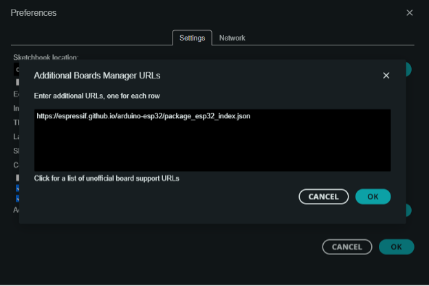

4)	In Boards Manager search for esp32 and install "esp32 by Espressif Systems" version 2.0.12.

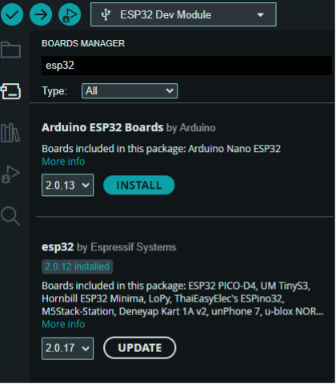

5)	Search for and install the Adafruit Neopixel library version 1.12.0

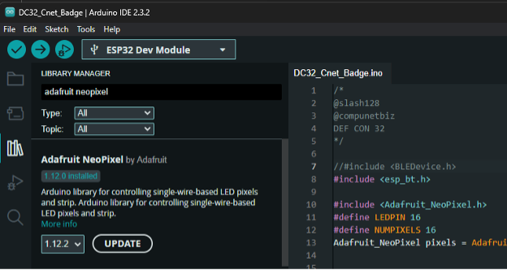

6)	Install the ESP32-A2DP Bluetooth library from the pschatzmann folder via Sketch->Include Library->Add ZIP Library.

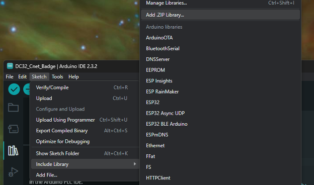

7) Offer Slash128 a crisp high-five

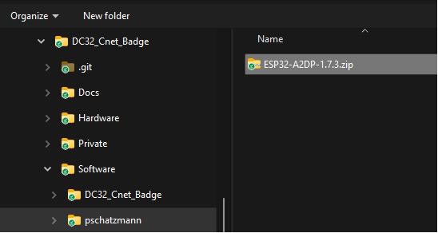

8)	Set the power switch to USB and connect via USB data cable.

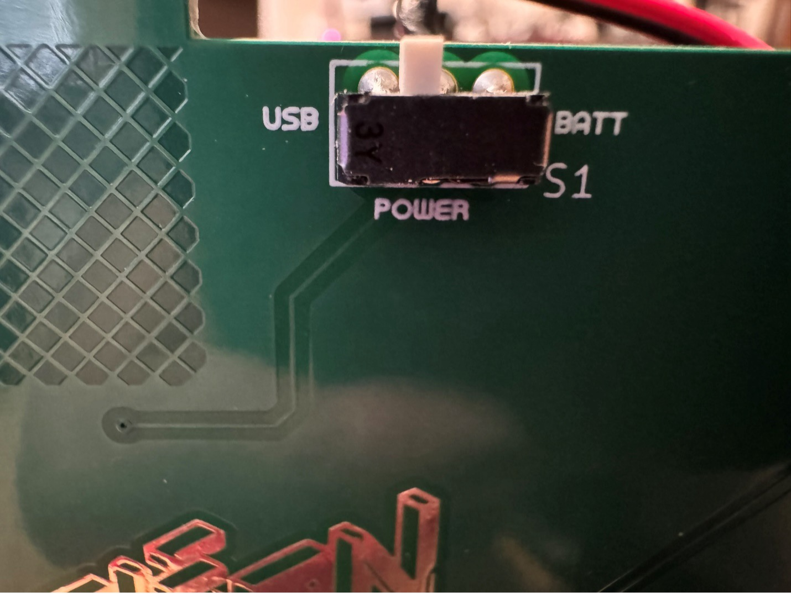

9)	Note the COM port detected in Device Manager and select that port in the Arduino IDE.

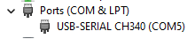

10)	Click on the board selection, then “Select other board and port…” and choose ESP32 Dev Module on your connected COM port.

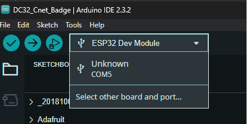

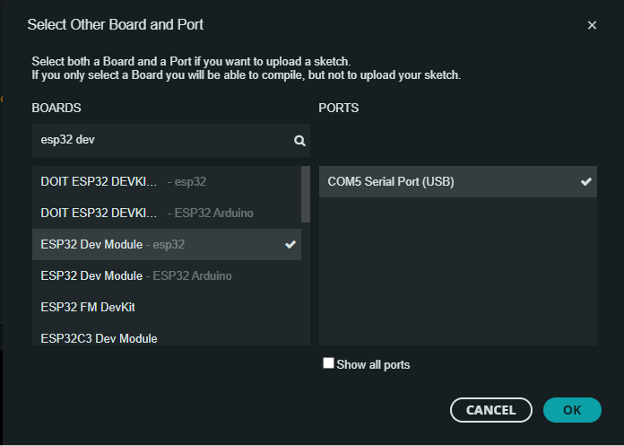

11)	Confirm the upload speed is set to “921600”

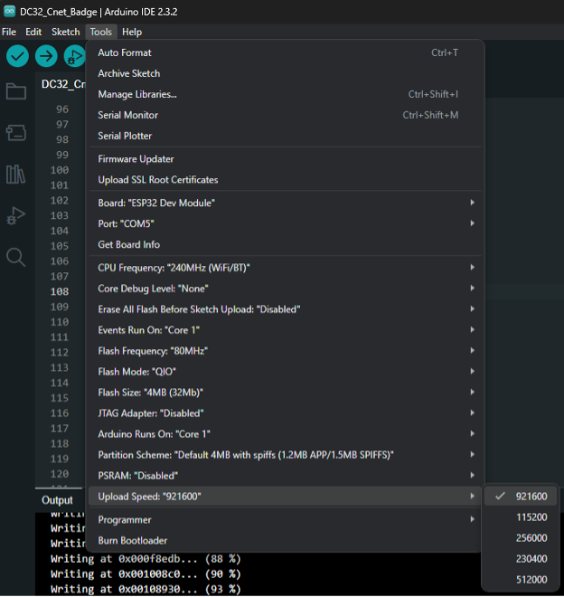

12)	Ignore prompts to update libraries or boards. Newer versions are sometimes incompatible.

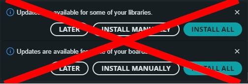

13)	Click the Upload button to upload the sketch.

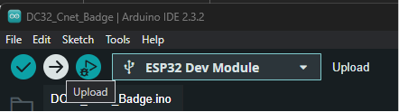

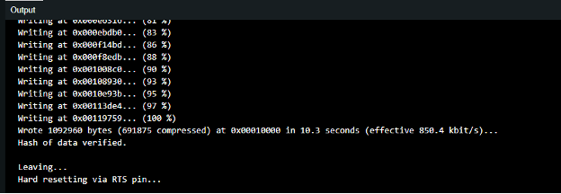

14)	If you want to see the debug messages click “Tools > Serial Monitor” and set the Serial Monitor speed to “921600”.

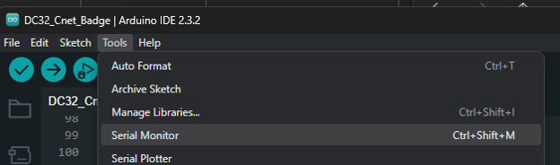

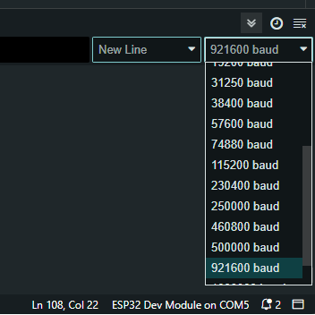

## Badge Operation

The power switch selects battery power or USB power. USB power will charge the battery. The battery must be sufficiently charged for battery operation. If the badge does not operate on battery power let it charge via USB. There is a battery “gas gauge” on the charge module that is viewable from the front of the board.

From your phone connect to Bluetooth device “FONY BITMAN”. Sound should play through the speakers and the LED strips should react to the music. The touch pads on the top front of the badge should act as music and volume controls.

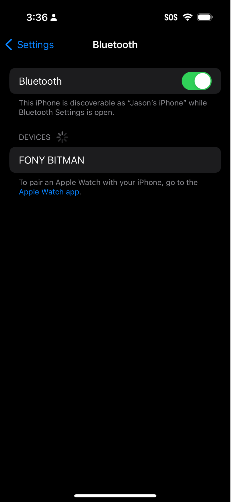