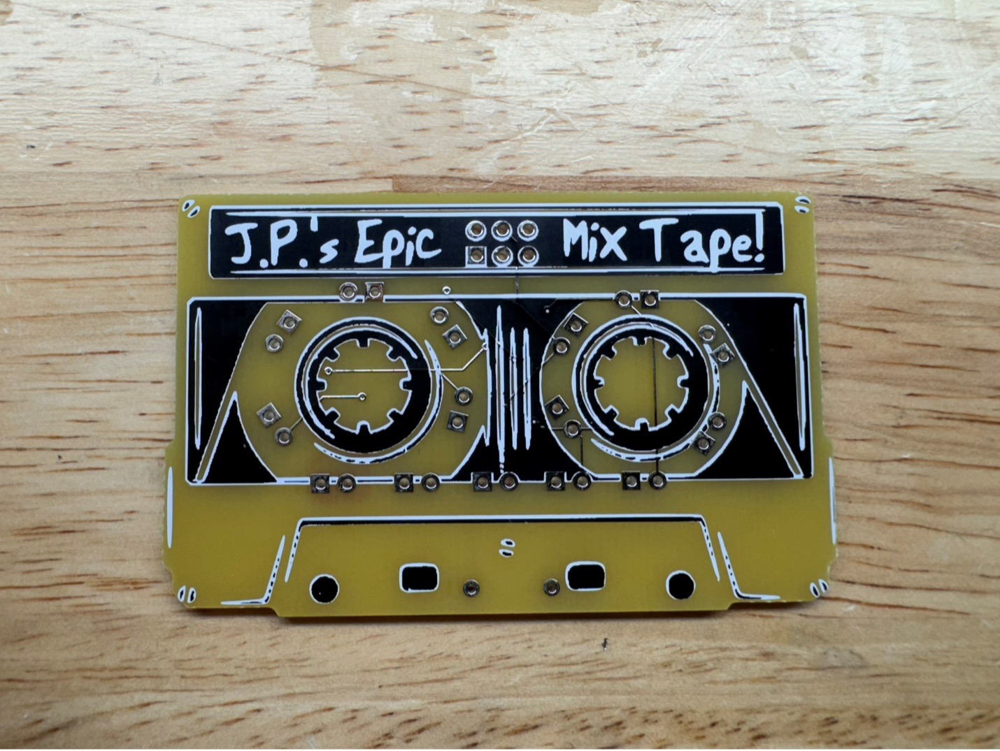
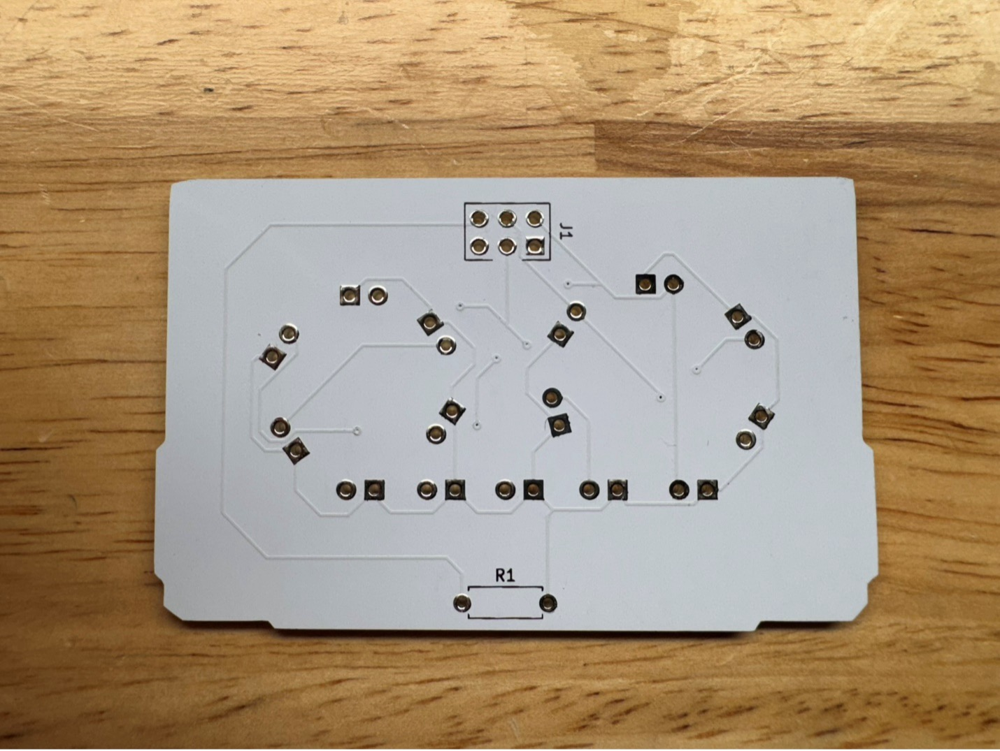
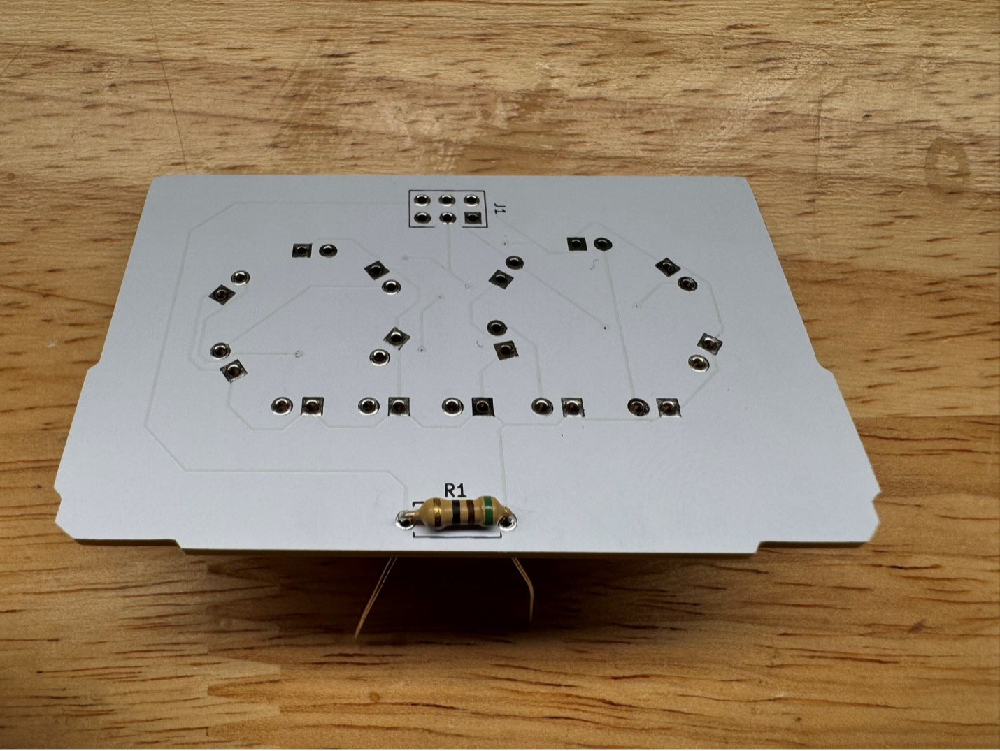
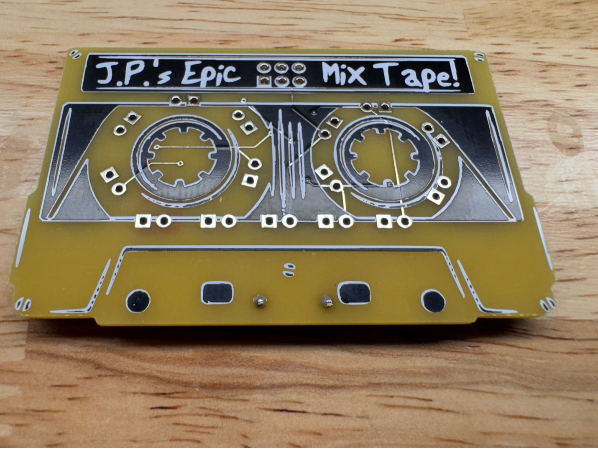
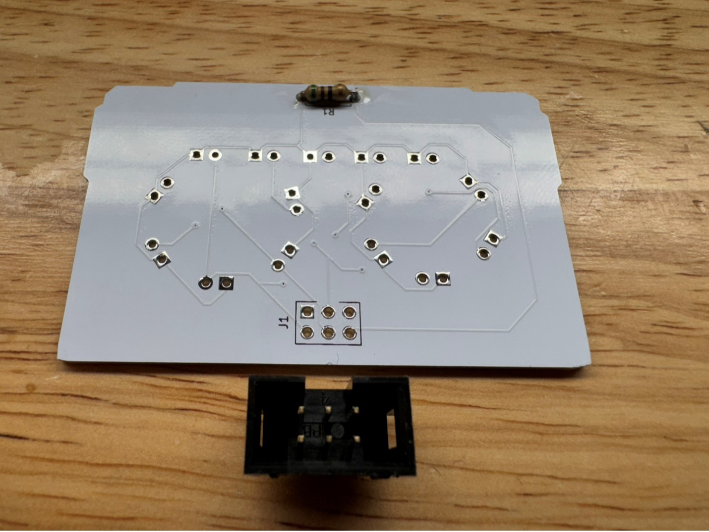
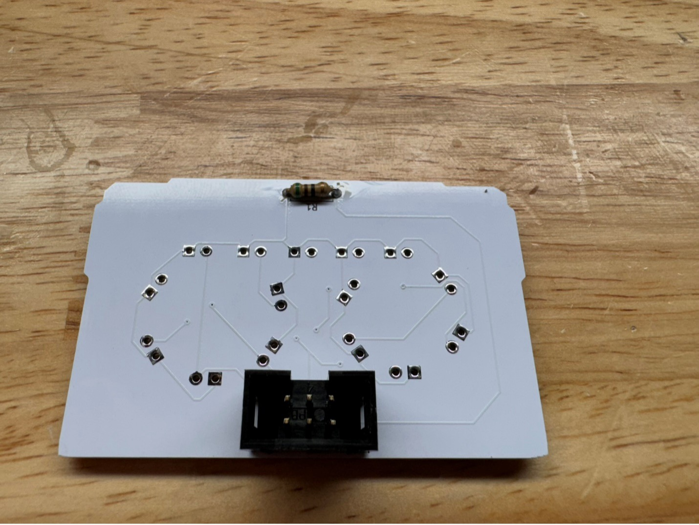
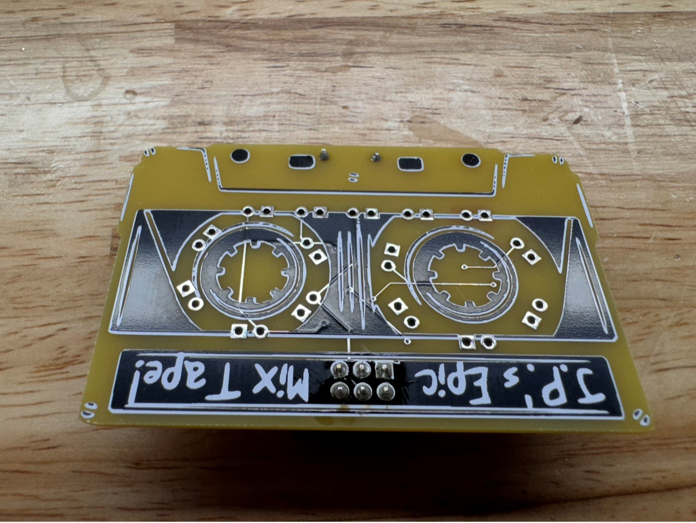
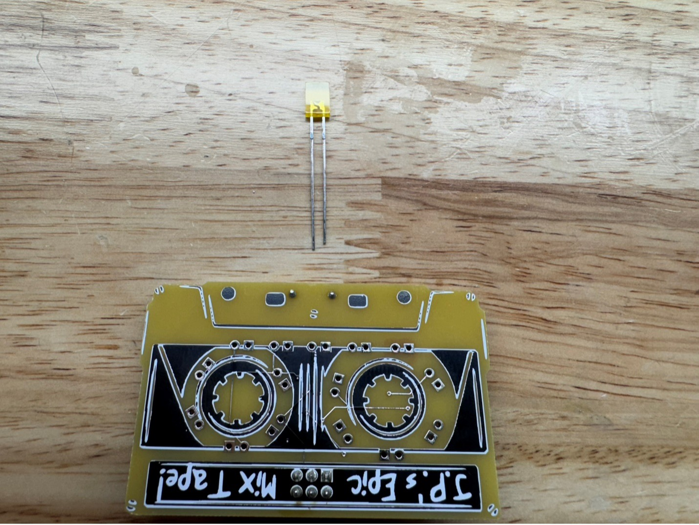
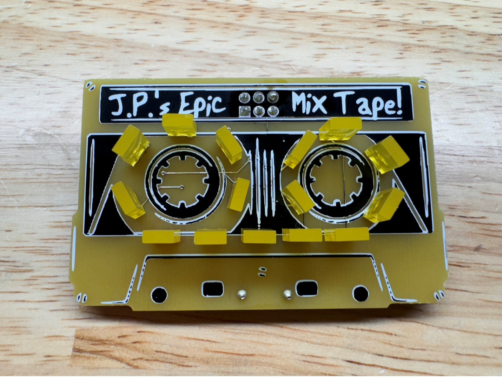
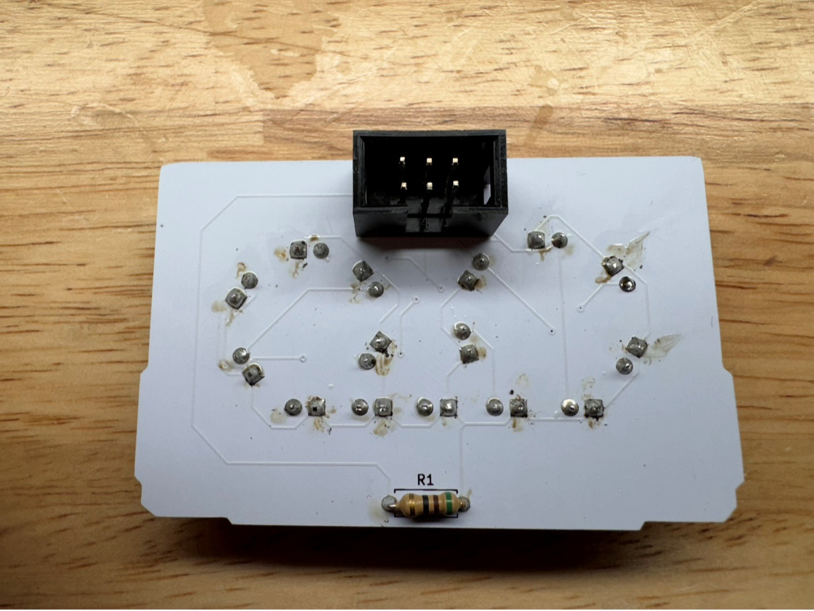

## Cassette SAO

Assembling the Cassette SAO

1)	Front view

2) Rear view

3)	Solder R1 to the back of the SAO

4)	Trim the leads

5)	Solder the SAO header matching the notch orientation

6)	Solder the 15 rectangular LEDS noting the polarity – the shorter leads goes in the square holes, longer leads in the round holes

7)	Trim the leads on the back

