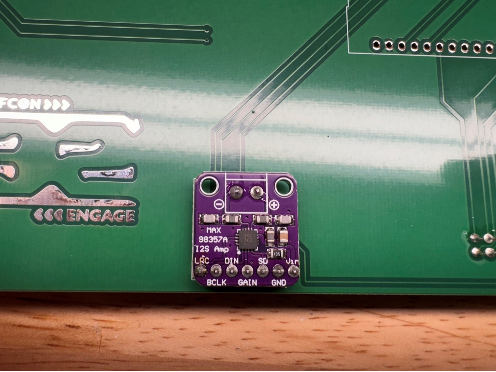

# DC32 CompuNet Badge 

## Part 1: Badge Assembly

### Badge Parts List

| QTY | Description        |
|-----|--------------------|
| 1   | 2 pos CONN HEADER  |
| 1   | switch             |
| 1   | 6 pos CONN HEADER  |
| 1   | 16 pos CONN HEADER |
| 1   | ESP-32             |
| 2   | LED Stick          |
| 1   | Amp                |
| 2   | speaker            |
| 1   | charge module      |
| 3   | foam tape          |
| 1   | battery            |

### Step 1: Front view:

### Step 2: Rear View

### Step 3: Solder LED strips to front

The DI (Data In) side connects to the badge pads.

### Step 4: Tin the LED & badge pads

### Step 5: Apply first LED

Line up the LED strip pads on the badge pads leaving the ends of the badge pads exposed so you can heat them up with your soldering iron. It’s a little tricky but you should be able to get the solder to flow and insert some solder from the sides of the pads to connect the pads. Try to keep the LED strip straight. 

### Step 6: Repeat for the second LED strip

### Step 7: Power Switch

Solder the power switch on the back with the switch tab facing up

### Step 8: Solder the SAO connector

Solder the SAO connector with the tab up matching the outline keeping it straight and parallel to the bottom oedge of the badge

### Step 9: Battery Charger Module

Locate the battery charger module and pin header and cut off 6 pins

### Step 10: Solder the module header

Solder the 6 pin header to the charge module with the short pins protruding through the white silkscreen side of the charge module

### Step 11: Attach module to the badge

Solder the charge module to the back of the badge

### Step 12: Verify LED visibility

The charge module battery level LEDs should be visibile through the front of the badge

### Step 13: Amplifier module

Locate the amplifier module and pin header, the green screw terminal is not needed and can be discarded

### Step 14: Solder amp header

Solder the pin header to the amplifier with the short side of the pins protruding through the silkscreen pin label side of the amplifier module

### Step 15: Attach pins to speaker outs

15)	Cut 2 more single pins and solder them to the speaker outputs with the short side protruding through the silkscreen pin label side of the amplifier module

### Step 16: Attach amp module to badge

Solder the amplifier module through the back of the badge

### Step 17: ESP32 Module

Solder the ESP32 module to the back of the badge with the USB connector oriented to the silkscreen outline which should face the CompuNet logo

### Step 18: Battery Connector

Solder the battery connector to the back of the badge

### Step 19: Speaker Wire

Trim the speaker wires leaving a few inches and run the speaker wires through the holes as shown for strain relief 

### Step 20: Tape Speakers

Cut two pieces of double-sided foam for speaker mounting (leave enough for a third piece for battery mounting)

### Step 21: Attach Speakers

Mount the speakers to the badge using the foam tape by standing the badge and speakers upraight before pressing them together so it balances and doesn’t tip over

### Step 22: Speaker Wires

Split and trim the speaker wires to solder to the badge

### Step 23: Solder Speaker Wires

Solder the speaker wires to the badge noting polarity – red to (+) and black to (-)

### Step 24: Power pigtail

Locate the JST PH 1.25 and JST PH 2.0 pigtail leads and 1 piece of heat shrink

### Step 25: Polarity Check

_***Important!***_

Verify Polarity!

Due to a part change with the JST PH 2.0 pigtail please confirm that the wires are in the correct position matching the photo above. If they are opposite then you need to swap them around by carefully lifting up the plastic tabs with tweezers, removing each wire, then slide them back in to the opposite side. 

**ASK IF YOU NEED HELP WITH THIS. PERFORMING THIS STEP INCORRECTLY WILL DAMAGE YOUR BADGE AND COULD BE A FIRE HAZZARD. 

PROCEED WITH CAUTION!!**

### Step 26: Pigtail

Slip the 2 pieces of heat shrink onto the JST PH 2.0 pig tail (fatter wires), then strip and tin the ends

### Step 27: Solder the Cables

Solder the wires together RED to RED and BLACK to BLACK, a set of “helping hands” can be helpful 😊

### Step 28: Apply Heatshrink

### Step 29: Badge Adhesive

Place the last piece if the double sided tape in the battery location on the back of the badge

### Step 30: Battery Leads

Route the battery leads using the pigtail connector, the leads can be tucked under the edges of the battery.

**Verify polarity is correct before connecting. If you're not sure, please ask.**

